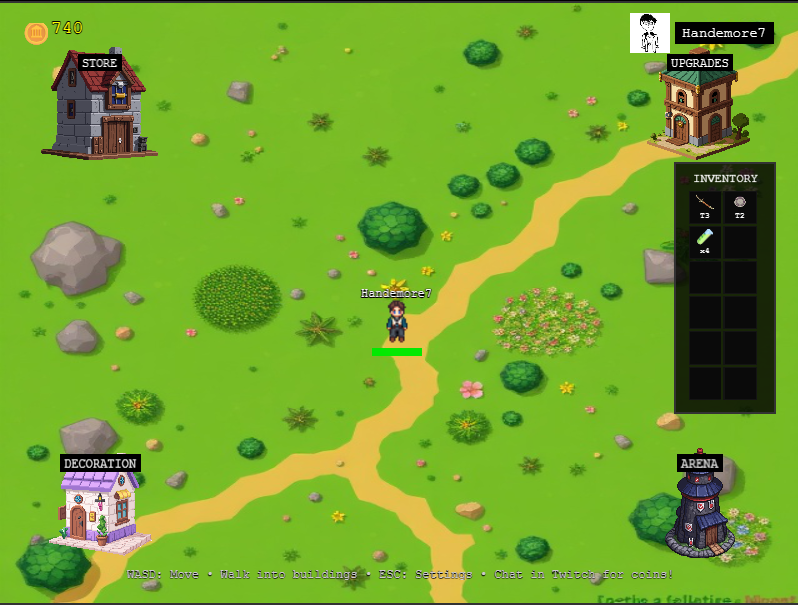
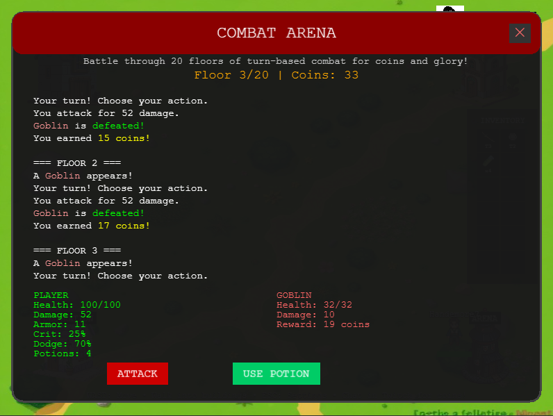
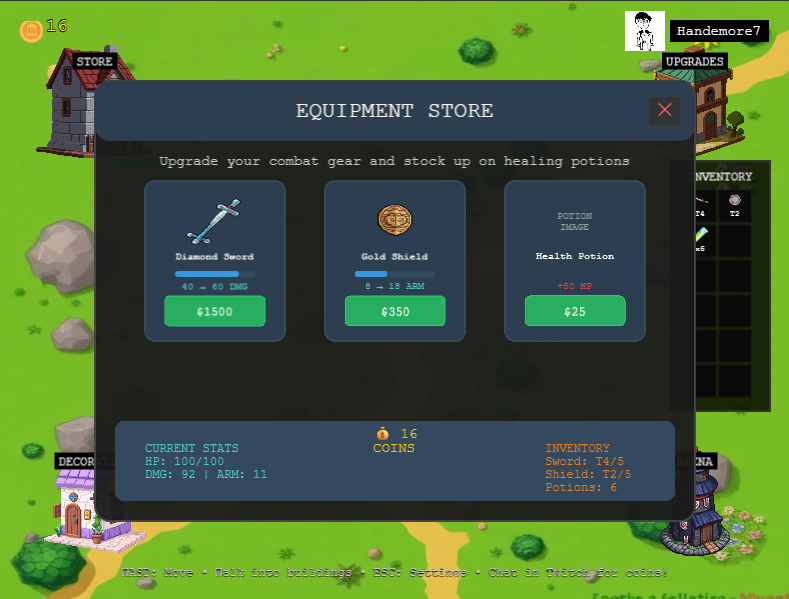
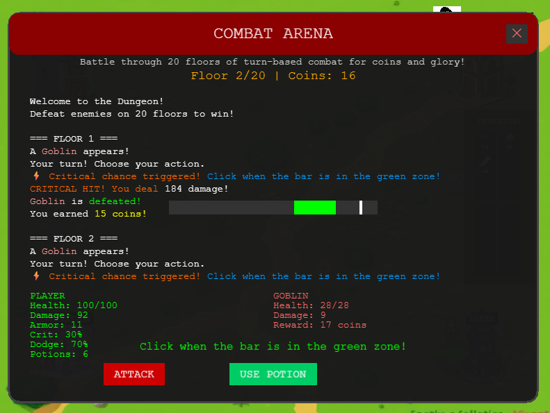

# Mini Tycoon

A browser-based 2D pixel art tycoon game with real-time multiplayer events and Twitch integration.
You can check it on: https://handemore7.github.io/Mini-tycoon/

*Image #1: Main game world with buildings and player character*

## 🎮 What is Mini Tycoon?

Build your empire through strategic purchases, combat, and community interaction. Earn money passively, battle in the arena, and participate in real-time events triggered by the community!

## ✨ Key Features

- **🏠 Interactive Buildings**: Store, Upgrades, Decorations, and Arena
- **⚔️ Turn-Based Combat**: 20-floor dungeon with strategic combat mechanics
- **💰 Multiple Income Sources**: Passive income, Twitch chat rewards, and arena victories
- **🎵 Dynamic Audio**: Immersive soundtrack that changes based on your location
- **🌐 Real-Time Events**: Community-voted events like coin rain, speed challenges, and critical madness
- **💾 Cloud Save**: Your progress is automatically saved to the cloud
- **🏆 Achievements**: Unlock special decorations through gameplay milestones

*Image #2: Arena combat system with turn-based battles*

## 🎯 How to Play

### Getting Started
1. **Launch**: Open `index.html` in any modern web browser
2. **Create Profile**: Enter a player name (3-20 characters) and optional Twitch username
3. **Follow Tutorial**: Interactive 7-step guide (press X to skip)

### Controls
- **WASD/Arrow Keys**: Move character
- **Walk into buildings**: Interact with them
- **C**: Open inventory
- **ESC**: Open settings
- **X**: Skip tutorial or close menus

### Earning Money
- **Passive**: Coins earned every second (base 1 coin/sec, upgradable)
- **Twitch Chat**: 10 coins per message (if connected)
- **Arena**: Bonus coins from victories
- **Events**: Special community events

*Image #3: Modern store interface with equipment upgrades*

## 🏗️ Buildings

- **🛒 Store** (Top-left): Buy weapons and shields to improve combat power
- **⬆️ Upgrades** (Top-right): Purchase permanent stat boosts and abilities
- **🏺 Decorations** (Bottom-left): Unlock cosmetic items through achievements
- **🏟️ Arena** (Bottom-right): Enter turn-based combat against procedurally generated enemies

## ⚡ Real-Time Events

Experience community-driven events:
- **🗳️ Server Votes**: Community decides the next event
- **🌧️ Coin Rain**: Collect falling coins for bonus money
- **🏃 Speed Challenge**: Temporary movement speed boost
- **⚡ Critical Madness**: Increased critical hit chance

*Image #4: Real-time event notifications and voting system*

## 🚀 Quick Start

1. **Download**: Get the game files from the repository
2. **Open**: Launch `index.html` in your browser
3. **Play**: No installation required!

### Optional Features
- **WebSocket Server**: Run `npm install && npm start` for real-time events
- **Twitch Integration**: Connect your Twitch channel for chat rewards

## 📱 Requirements

- **Browser**: Chrome, Firefox, Safari, or Edge (latest versions)
- **Internet**: Required for cloud saves and real-time events
- **Storage**: ~50MB for game assets
- **No installation needed**

## 🛠️ Technical Details

**Built with:**
- **Frontend**: HTML5 Canvas, Phaser.js game engine
- **Backend**: Node.js, Socket.IO for real-time events
- **Database**: Firebase Firestore with localStorage fallback
- **Integration**: Twitch IRC API for chat monitoring
- **Deployment**: Railway/Render/Heroku for server hosting

**Architecture:**
- Enterprise-level state management with validation
- Memory management and asset preloading
- Comprehensive error handling and logging
- Cross-platform compatibility

For detailed technical documentation, see [DOCUMENTATION.md](DOCUMENTATION.md).